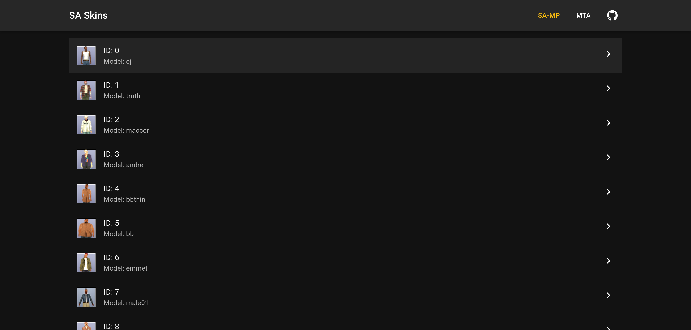
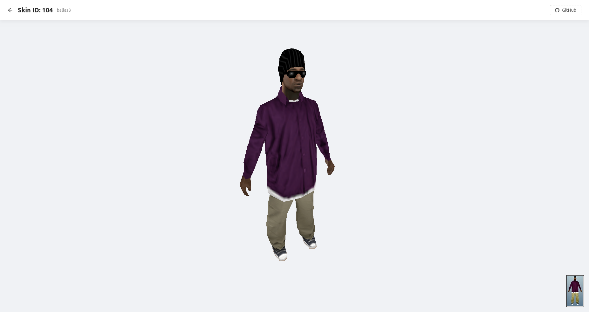

# SA Skins

✨ [Open application](https://kewka.github.io/sa-skins/)

A simple web application for viewing skins from the game [GTA San Andreas](https://en.wikipedia.org/wiki/Grand_Theft_Auto:_San_Andreas).

## Build skins files

The _skins.zip_ archive contains [Renderware files](https://gtamods.com/wiki/RenderWare_binary_stream_file) for [all skins](https://wiki.sa-mp.com/wiki/Skins:All). All files (except _cj.dff_ and _cj.txd_) are taken from the original [GTA SA](https://en.wikipedia.org/wiki/Grand_Theft_Auto:_San_Andreas) and [SAMP](https://www.sa-mp.com/) resources.

The _src/data/skins.json_ file contains an array of [all skins](https://wiki.sa-mp.com/wiki/Skins:All).

1. Extract _skins.zip_ to the _skins_ folder.
2. Initialize the [txd2png](https://github.com/Kewka/txd2png) and [dff2obj](https://github.com/Kewka/dff2obj) submodules. and make sure that you have all their dependencies installed. You also need to run `./build` inside _txd2png_ folder.
3. Use `node ./scripts/copy-skins.js` for copy skins files to the _public_ folder.
4. Use `node ./scripts/build-skins.js` for convert skins to OBJ+MTL files.

## Screenshots

### Boilerplate

This project was bootstrapped with [Create React App](https://github.com/facebook/create-react-app).
